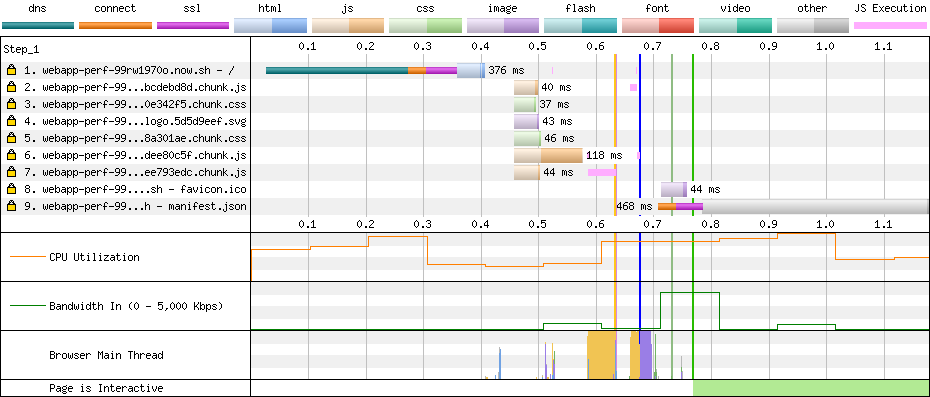

## 单页应用资源加载性能优化

此仓库试图讲述如何为一个典型的单页应用（React 应用）进行资源加载的优化。优化步骤以分支的形式体现，当前 `master` 分支为未优化的初始代码。

初始代码非常简单，使用了 Create React App 创建了一个最基本的 React 应用，并且添加了 `react-router-dom` 路由库，整个前端应用由两个页面组成，一个是主页，一个是 About 页。页面的加载使用了 `import()` 动态加载的方式来进行懒加载，以此来减少主 bundle 的体积，这也是现在比较常见的以路由进行代码分割的方式。

项目使用了 [now](https://zeit.co/docs/v2/integrations/now-for-github/) 进行持续集成并且生成 demo 链接。

当前分支的 demo 可以直接访问 [https://webapp-perf.now.sh/](https://webapp-perf.now.sh/) 。此仓库是公开的，所以你可以通过访问 [https://webapp-perf.now.sh/_src](https://webapp-perf.now.sh/_src) 进行浏览当前 demo 的源代码，当然也可以在 GitHub 上浏览代码。

通过使用 [WebPageTest](https://www.webpagetest.org) 对初始代码进行性能测试，可以得到这样一张资源加载瀑布图：

具体结果可以访问 [https://www.webpagetest.org/result/190114_72_7d845d3faa50617d157d9e93fffa5301/1/details/](https://www.webpagetest.org/result/190114_72_7d845d3faa50617d157d9e93fffa5301/1/details/) 查看。
